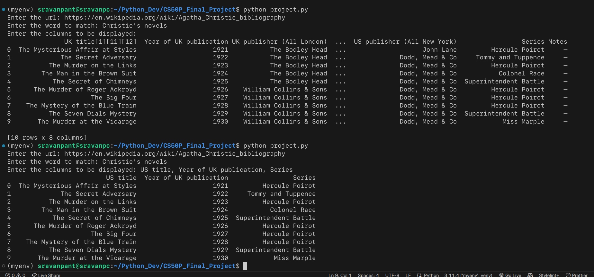

# CS50P Final Project: Web Scraper

### Video Demo: [CS50P Final Project: Web Scraper](https://youtu.be/Bw-IWZlWPLw)

## Description:

- Web scraping refers to the automated process of extracting data from websites by utilizing software tools or scripts.
- The purpose of web scraping is to gather valuable data from websites in a structured and organized format.
- This data can then be used for analysis, research, decision-making, or creating innovative solutions.
- Powerful tools for the web scraping endeavor include Python and Pandas.
- Python is a popular programming language that can be used for many things, including web scraping.
- Pandas is a Python package with capabilities for data analysis and manipulation.
- The scraped data was extracted and cleaned using Pandas.
- Python was chosen because of its huge library collection and ease of use.
- Pandas was chosen because it handles enormous amounts of data effectively.
- Python and Pandas made it possible to scrape data from numerous sources and conduct insightful analysis.
- Python and Pandas are the tools used to scrape data from Agatha Christie's books.
- Information is taken from websites, cleaned up, and then stored in a systematic manner.
- Managing conflicting data from numerous websites is a challenge.
- Python with Pandas made effective data processing and manipulation possible.
- The end result was the development of an extensive dataset on Agatha Christie's books.
- This web scraper scrapes data from a website and saves it in a csv file and then read the csv file and print first 10 rows of the data.
- The data to be scraped is the list of all the books of Agatha Christie on the Wikipedia.
- URL:
  ```
  https://en.wikipedia.org/wiki/Agatha_Christie_bibliography
  ```

## About:

This project contains the following:

- `project.py`
- `test_project.py`
- `requirements.txt`
- `Christie's novels.csv`

**`project.py`** has three additional functions in addition to the main function:

- `read_HTML()` Using the pandas [`read_html`](https://pandas.pydata.org/docs/reference/api/pandas.read_html.html) method, this function pulls the HTML from the webpage and returns the first element of the list containing the necessary HTML.
- `convert_to_csv()` This function converts the data gathered by the `read_HTML` into csv format using the pandas [`to_csv`](https://pandas.pydata.org/docs/reference/api/pandas.DataFrame.to_csv.html) method and returns the file name of the csv file.
- `read_csv_file()` Using the pandas [`read_csv`](https://pandas.pydata.org/docs/reference/api/pandas.read_csv.html) method, this function reads the specified csv file and returns the data it contains.
- `main()` The application requests the user-input URL for related table data types, the table heading, and any particular columns that should be printed in this instance.
  

**`test_project.py`** has three test functions:

- `test_read_HTML()` This function tests the `read_HTML` function.
- `test_convert_to_csv()` This function tests the `convert_to_csv` function.
- `test_read_csv_file()` This function tests the `read_csv_file` function.

## Usage:

1. Install the libraries required:
   ```
   pip install pandas
   ```
2. Open the terminal, `cd` into the cloned project file and run:
   ```
   python project.py
   ```
3. Enter the url from which you will scrape the data of a table
   ```
   Enter the url: https://en.wikipedia.org/wiki/Agatha_Christie_bibliography
   ```
4. Enter the table heading
   ```
   Enter the word to match: Christie's novels
   ```
5. Enter the precise column heading that you want to print. If not, leave blank to print all the columns.
   ```
   Enter the columns to be displayed: US title, Year of UK publication, Series
   ```
6. After hitting `Enter` key you will get the following printed in your terminal
   ```
                                 US title  Year of UK publication                 Series
       0  The Mysterious Affair at Styles                    1921         Hercule Poirot
       1             The Secret Adversary                    1922     Tommy and Tuppence
       2          The Murder on the Links                    1923         Hercule Poirot
       3        The Man in the Brown Suit                    1924           Colonel Race
       4           The Secret of Chimneys                    1925  Superintendent Battle
       5      The Murder of Roger Ackroyd                    1926         Hercule Poirot
       6                     The Big Four                    1927         Hercule Poirot
       7    The Mystery of the Blue Train                    1928         Hercule Poirot
       8          The Seven Dials Mystery                    1929  Superintendent Battle
       9       The Murder at the Vicarage                    1930            Miss Marple
   ```

## Screenshots:




## Credits:

- [Agatha Christie Bibliography](https://en.wikipedia.org/wiki/Agatha_Christie_bibliography)
- [CS50’s Introduction to Programming with Python](https://cs50.harvard.edu/python/2022/)
- [Pandas](https://pandas.pydata.org/docs/index.html)
- [Python](https://docs.python.org/3/)
